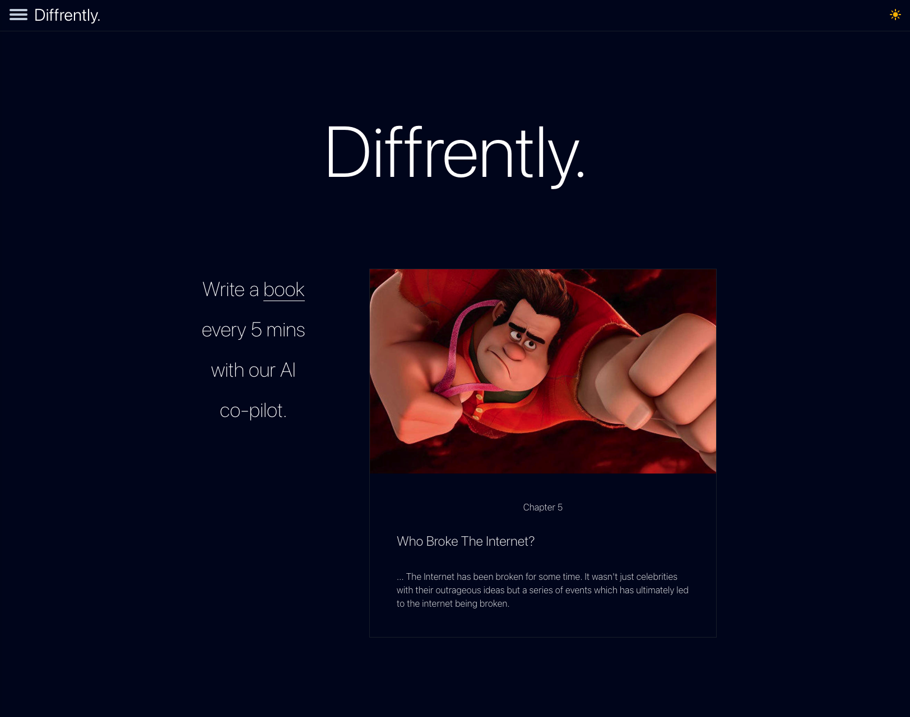

# Diffrently

Write a book every 5 mins with our AI co-pilot.

[](https://choosealicense.com/licenses/gpl-3.0/)



# Diffrently Roadmap

## Features

 * [ ] Social Logins (Facebook, Twitter)
 * [ ] TypeScript migration
 * [ ] Re-structure chapters
 * [ ] View author's book
 * [ ] Stripe Payment

## FREE to use under GPLv3 license

Help improve the open source version by using it freely under the GPLv3 license. All modifications must be added back to the source code.

## Or purchase a one-time commercial license

1. Open Source Front-End library
2. Firebase function code
3. AWS Lambda code

## [Talent PR](#talent-pr)

Migrating from React.js (JavaScript) to React.js (TypeScript)

1. Type Annotations
2. Interfaces and Types
3. Unions and Intersections
4. Enums
5. Generics

## Storybook

https://storybook.flipbio.co

## Run locally

**Note: Must set up Firebase acc. first.**

Clone the project

```bash
  git clone https://github.com/jamesstar89/flipbio-app
```

Go to the project directory

```bash
  cd my-project
```

Install dependencies

```bash
  npm install
```

Start the server

```bash
  npm run start
```

## Articles

1. [Folder structures](https://dev.to/itswillt/folder-structures-in-react-projects-3dp8)
2. [conventional-commits](https://gist.github.com/Zekfad/f51cb06ac76e2457f11c80ed705c95a3)
3. [React icons](https://react-icons.github.io/react-icons/)
4. [Tailwind CSS](https://tailwindcss.com/docs)
5. [Pagedone](https://pagedone.io/)
6. [Flowbite](https://flowbite.com/docs/getting-started/introduction/)
7. [Creative Tim](https://www.creative-tim.com/twcomponents)
8. [React checkbox](https://dev.to/collegewap/how-to-work-with-checkboxes-in-react-44bc)
9. [Learn TypeScript](https://www.youtube.com/watch?v=3mDny9XAgic)
10. [Add TypeScript To An Existing React Project](https://www.totaltypescript.com/add-typescript-to-existing-react-project)
11. [React TypeScript Cheatsheet](https://react-typescript-cheatsheet.netlify.app/docs/basic/getting-started/function_components/)
12. [TypeScript for the new programmer](https://www.typescriptlang.org/docs/handbook/typescript-from-scratch.html)

## Acknowledgements

 - [OpenAI](https://openai.com)
 - [Firebase](https://firebase.google.com)
 - [React](https://react.dev)
 - [Netlify](https://netlify.com)