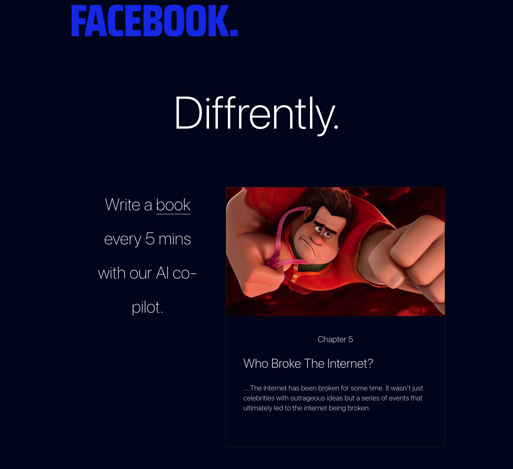

# Diffrently

Write a book every 5 mins with our AI co-pilot.

[](https://choosealicense.com/licenses/gpl-3.0/)



# Diffrently Roadmap

## Features

 * [ ] Social Logins (Facebook, Twitter)
 * [ ] Post edit the Diffrently way
 * [ ] Stripe Payment
 * [ ] Re-order chapters
 * [ ] Render book

## FREE to use under GPLv3 license

Help improve the open source version by using it freely under the GPLv3 license. All modifications must be added back to the source code.

## Or purchase a one-time commercial license

1. Open Source Front-End library
2. Firebase function code
3. AWS Lambda code

## Storybook

https://storybook.flipbio.co

## Run locally

**Note: Must set up Firebase acc. first.**

Clone the project

```bash
  git clone https://github.com/jamesstar89/flipbio-app
```

Go to the project directory

```bash
  cd my-project
```

Install dependencies

```bash
  npm install
```

Start the server

```bash
  npm run start
```

## Articles
1. [Folder structures](https://dev.to/itswillt/folder-structures-in-react-projects-3dp8)
2. [React icons](https://react-icons.github.io/react-icons/)
3. [Tailwind CSS](https://tailwindcss.com/docs)
4. [Pagedone](https://pagedone.io/)
5. [Flowbite](https://flowbite.com/docs/getting-started/introduction/)
6. [Creative Tim](https://www.creative-tim.com/twcomponents)

## Acknowledgements

 - [OpenAI](https://openai.com)
 - [Firebase](https://firebase.google.com)
 - [React](https://react.dev)
 - [Netlify](https://netlify.com)